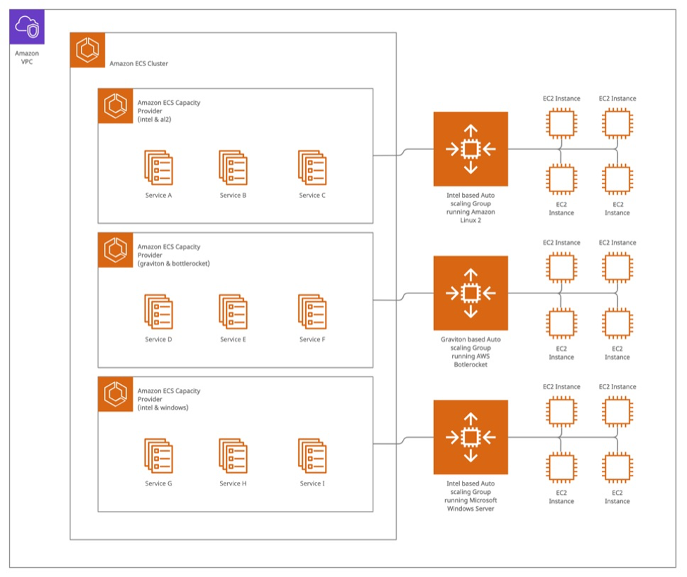

+++
title = 'Automate Patching by Replacing Amazon ECS Container Instances'
date = '2022-05-18T11:10:42-08:00'
draft = false
tags = ["aws", "ecs", "ec2", "fargate", "patching"]
+++

*Originally published on [AWS for Industries](https://aws.amazon.com/blogs/industries/automate-patching-by-replacing-amazon-ecs-container-instances/).*

*By Nick Silverman, Jigna Gandhi, Kim Fushimi, and Randy Moy.*

## Containerization becoming popular for application lifecycle

In the retail industry, more and more developers are using containerization as the primary software lifecycle for applications and services. There are countless benefits to this approach, and it shifts the focus of configuration and runtime management to the container itself. This means that there’s much less configuration and setup at the host level. However, you still need to consider patching and security at the host.

This blog will describe how [Rue Gilt Groupe](https://aws.amazon.com/partners/success/rue-gilt-groupe-databricks/) (RGG), a premier off-price ecommerce company comprised of [Rue La La](https://www.ruelala.com/boutique/), [Gilt](https://www.gilt.com/boutique/), [Gilt City](https://help.gilt.com/hc/en-us/articles/360006450993-Gilt-City-Overview), and [Shop Premium Outlets](https://shoppremiumoutlets.com/), implemented an automated solution to patch and replace hosts that run the company’s containerized applications with zero downtime and minimal impact to the containers running within clusters.

## Infrastructure and setup

Before we dive into how we implemented the automated patching, let’s discuss the underlying architecture that uses Amazon Web Services (AWS). With [Amazon Elastic Container Service](https://aws.amazon.com/ecs/) (Amazon ECS), a fully managed container orchestration service, customers can determine the optimal compute level for their containers to run in a cluster. In an Amazon ECS cluster, you can use different types of instances from [Amazon Elastic Compute Cloud](https://aws.amazon.com/ec2/) (Amazon EC2), which has secure and resizable compute capacity for virtually any workload, and/or [AWS Fargate](https://aws.amazon.com/fargate/), a serverless, pay-as-you-go compute engine, to serve the container use cases running in the cluster. For users that choose Amazon EC2 as the underlying compute for their clusters, we recommend managing the instances within a [group](https://docs.aws.amazon.com/autoscaling/ec2/userguide/AutoScalingGroup.html) in [Amazon EC2 Auto Scaling](https://aws.amazon.com/ec2/autoscaling/), where you can add or remove compute capacity to meet changes in demand, because managing cluster autoscaling on your own is difficult; you need to carefully monitor your compute capacity, so that you scale up and down at precise times to meet demand fluctuations. Instead, using [Amazon ECS capacity providers](https://docs.aws.amazon.com/AmazonECS/latest/developerguide/cluster-capacity-providers.html) and cluster autoscaling, Amazon ECS will scale the underlying Amazon EC2 instances to meet the capacity of the desired task counts. With capacity providers, you can scale to a reservation percentage target and queue containers for launch when additional capacity becomes available. We will use both technologies to automate the instance replacement process. Below is a sample architecture using the [best practices](https://docs.aws.amazon.com/AmazonECS/latest/bestpracticesguide/security.html) and guidelines that we have described.

## Pre-requisites

1. An ECS Cluster
2. [AWS CLI](https://docs.aws.amazon.com/cli/latest/userguide/cli-chap-welcome.html) installed with appropriate permissions if you want to execute each step from command line
3. Docker environment



In this example, we have three Amazon EC2 Auto Scaling groups that provide hosts to the cluster. Amazon ECS can use these clusters to run containers. Each one uses a different instance type and operating system, which can handle different types of workloads.

You can configure Amazon ECS services to use specific capacity providers based on the different capacity provider strategy options. We highly recommend configuring container health checks by attaching to a target group that has its own health checks or by configuring the health checks in the task definition itself.

Managing hosts through Amazon EC2 Auto Scaling groups offers many benefits. To automate instance replacements as a strategy for patching, you can update an [Amazon Machine Image](https://docs.aws.amazon.com/AWSEC2/latest/UserGuide/AMIs.html) (AMI) ID in your launch configuration (or launch template), and the Amazon EC2 Auto Scaling group will launch the new instances with the new AMI ID. Because AWS regularly updates AMIs with security patches and software updates, you can update the ASG’s launch template with a new version of the same AMI and then replace all of the instances running in that Amazon EC2 Auto Scaling group.

## Automating Amazon EC2 Instance replacement

Now that we’ve explained the general infrastructure and configurations that make up an Amazon ECS cluster, we can use the infrastructure to implement an automated host replacement process. We explain the step-by-step process below. It relies heavily on AWS APIs built into both the Amazon ECS and Amazon EC2 Auto Scaling group services.

1. For a given Amazon ECS cluster, implement the `aws ecs list-container-instances` command and use the returned list of container instance ARNs as input to the `aws ecs describe-container-instances` command. You should store the instance ID, instance ARN, and running task count for each instance.
2. Then, implement the `aws ecs describe-cluster` command and use the returned list of capacity providers as input to the `aws ecs describe-capacity-providers` command. Store the Amazon EC2 Auto Scaling group name associated with each capacity provider.
3. Then, for each stored Amazon EC2 Auto Scaling group, implement the `aws autoscaling describe-auto-scaling-groups` command. You’ll need information about the current launch template attached to the Amazon EC2 Auto Scaling group. Once you have that, you can implement the `aws ec2 describe-launch-template-versions` to get the current AMI in use. Finally, you can use the `aws ec2 describe-images` command to retrieve the platform and architecture of the AMI.
4. Using a preconfigured map of AMI name patterns (or SSM parameters with AMI IDs), you can look up the latest AMI matching the current AMI and create a new version of the existing launch template with this new AMI version using the `aws ec2 create-launch-template-version` command. We use the tags on the instances that were set by the Auto Scaling group to match an AMI from the map. From there, you can set the new version as the launch template default version, which the Amazon EC2 Auto Scaling group will then use.
5. Once that is complete, you can replace the hosts one by one using the commands we gathered in step 1.

   a. First, you’ll detach the instance from its Amazon EC2 Auto Scaling group using the `aws autoscaling detach-instances`. This allows the Amazon EC2 Auto Scaling group to replace the instance, but it does not yet remove it from the Amazon ECS cluster. Then, you can do the rest of the work while the Amazon EC2 Auto Scaling group replaces this host.

   b. Then, you implement the `aws ecs update-container-instances-state` and set the state to draining. This begins the process of replacing any containers that are currently running on the draining host.

   c. You will then wait for the host to completely drain by querying to find out how many tasks are still running. When an Amazon ECS and Amazon EC2 host gets put into a draining state:

   - The scheduler will no longer schedule tasks on that host.
   - The scheduler will gracefully stop the tasks on the host.
   - For services, the scheduler will meet the desired state of the service and count of tasks required by that service. This means that it will reschedule tasks from the draining host to another host based on the deployment configuration parameters.
   - For standalone ad-hoc type tasks, the scheduler will wait until the tasks are complete and they exit on their own.

   d. This will take a while for a few reasons:

   - There is a deregistration delay, which is configurable on containers, attached to target groups.
   - It takes time for new containers to get up and running in a healthy state. This is a safety mechanism so that you don’t kill containers until others take their place.
   - If nonservice containers are running, the host will simply wait until those containers stop and complete before moving on.

   e. Finally, once the instance has drained and is no longer running containers, you can safely close out the instance using the `aws ec2 terminate-instance` command.

You should repeat steps 3–5 for each Amazon EC2 Auto Scaling group configured as a capacity provider in the given Amazon ECS cluster. You will replace every host inside of each Amazon EC2 Auto Scaling group. But be sure to wait patiently until all containers are replaced safely. Overall, this can take a long time depending on your number of hosts and containers and how long it takes to deregister old containers and run new, healthy ones.

## Reference code

Here is the reference code for the process to automatically replace Amazon EC2 instances. This implementation uses Python and Boto3 and runs inside a Docker container. This can run anywhere, but you should not run it on a cluster instance that will be replaced as part of this automation because the process might never move past the host on which it’s running. However, this kind of container is a great use case for AWS Fargate because it can run within the same cluster on which the script is running.



`ecs.py`

```python
class ECS:
    def __init__(self, name, boto_session, boto_config):
        self.boto = boto_session.client(
            'ecs',
            config=boto_config
        )
        self.name = name
        self.__cluster_instances()
        self.__cluster_asgs()

    def __cluster_instances(self):
        cluster_instances = []
        resp = self.boto.list_container_instances(
            cluster=self.name
        )
        instances = self.boto.describe_container_instances(
            cluster=self.name,
            containerInstances=resp['containerInstanceArns']
        )
        for instance in instances['containerInstances']:
            cluster_instances.append({
                'instance_id': instance['ec2InstanceId'],
                'arn': instance['containerInstanceArn'],
                'running_count': instance['runningTasksCount']
            })
        self.cluster_instances = sorted(cluster_instances, key=lambda k: k['running_count'])

    def __cluster_asgs(self):
        self.cluster_asgs = []
        resp = self.boto.describe_clusters(
            clusters=[self.name]
        )
        capacity_providers = self.boto.describe_capacity_providers(
            capacityProviders=resp['clusters'][0]['capacityProviders']
        )
        for provider in capacity_providers['capacityProviders']:
            if provider['status'] == 'ACTIVE':
                asg_name = provider['autoScalingGroupProvider']['autoScalingGroupArn'].split('/')[-1]
                self.cluster_asgs.append(asg_name)

    def drain_instance(self, instance):
        self.boto.update_container_instances_state(
            cluster=self.name,
            containerInstances=[instance['arn']],
            status='DRAINING'
        )

    def instance_task_count(self, instance):
        resp = self.boto.describe_container_instances(
            cluster=self.name,
            containerInstances=[instance['arn']]
        )
        return resp['containerInstances'][0]['runningTasksCount']

    def deregister_instance(self, instance):
        self.boto.deregister_container_instance(
            cluster=self.name,
            containerInstance=instance['arn']
        )
```

`asg.py`

```python
class ASG:
    def __init__(self, name, boto_session, boto_config):
        self.boto_asg = boto_session.client(
            'autoscaling',
            config=boto_config
        )
        self.boto_ec2 = boto_session.client(
            'ec2',
            config=boto_config
        )
        self.boto_ssm = boto_session.client(
            'ssm',
            config=boto_config
        )
        self.name = name
        self.__asg_info()
        self.__lt_curr_ami()
        self.__latest_ami()

    def __asg_info(self):
        resp = self.boto_asg.describe_auto_scaling_groups(
            AutoScalingGroupNames=[self.name]
        )
        self.instances = [instance['InstanceId'] for instance in resp['AutoScalingGroups'][0]['Instances']]
        if resp['AutoScalingGroups'][0].get('MixedInstancesPolicy') is not None:
            lt = resp['AutoScalingGroups'][0]['MixedInstancesPolicy']['LaunchTemplate']['LaunchTemplateSpecification']
        elif resp['AutoScalingGroups'][0].get('LaunchTemplate') is not None:
            lt = resp['AutoScalingGroups'][0]['LaunchTemplate']
        else:
            return None
        self.lt_name = lt['LaunchTemplateName']
        self.lt_version = lt['Version']
        self.orig_desired = resp['AutoScalingGroups'][0]['DesiredCapacity']
        self.os_name = next(tag['Value'] for tag in resp['AutoScalingGroups'][0]['Tags'] if tag['Key'] == 'OS')

    def __lt_curr_ami(self):
        ltv = self.boto_ec2.describe_launch_template_versions(
            LaunchTemplateName=self.lt_name,
            Versions=[str(self.lt_version)]
        )
        self.lt_curr_ami = ltv['LaunchTemplateVersions'][0]['LaunchTemplateData']['ImageId']
        ami = self.boto_ec2.describe_images(
            ImageIds=[self.lt_curr_ami]
        )
        self.platform = ami['Images'][0]['PlatformDetails'].lower()
        self.architecture = ami['Images'][0]['Architecture'].lower()

    def __latest_ami(self):
        ami_params = {
            'al2': {
                'arm64': '/aws/service/ecs/optimized-ami/amazon-linux-2/arm64/recommended/image_id',
                'x86_64': '/aws/service/ecs/optimized-ami/amazon-linux-2/recommended/image_id'
            },
            'bottlerocket': {
                'arm64': '/aws/service/bottlerocket/aws-ecs-1/arm64/latest/image_id',
                'x86_64': '/aws/service/bottlerocket/aws-ecs-1/x86_64/latest/image_id'
            },
            'windows': {
                'x86_64': '/aws/service/ami-windows-latest/Windows_Server-2019-English-Full-ECS_Optimized/image_id',
            }
        }
        resp = self.boto_ssm.get_parameter(
            Name=ami_params[self.os_name][self.architecture]
        )
        self.latest_ami = resp['Parameter']['Value']

    def instance_ami(self, instance_id):
        instance = self.boto_ec2.describe_instances(
            InstanceIds=[instance_id]
        )
        return instance['Reservations'][0]['Instances'][0]['ImageId']

    def curr_capacity(self):
        resp = self.boto_asg.describe_auto_scaling_groups(
            AutoScalingGroupNames=[self.name]
        )
        return resp['AutoScalingGroups'][0]['DesiredCapacity']

    def update_launch_template(self):
        resp = self.boto_ec2.create_launch_template_version(
            LaunchTemplateName=self.lt_name,
            SourceVersion=str(self.lt_version),
            VersionDescription='Automated AMI Update',
            LaunchTemplateData={
                'ImageId': self.latest_ami
            }
        )
        self.lt_new_ver = resp['LaunchTemplateVersion']['VersionNumber']

    def set_launch_template_version(self):
        self.boto_ec2.modify_launch_template(
            LaunchTemplateName=self.lt_name,
            DefaultVersion=str(self.lt_new_ver)
        )

    def detach_instance_from_asg(self, instance_id):
        self.boto_asg.detach_instances(
            InstanceIds=[instance_id],
            AutoScalingGroupName=self.name,
            ShouldDecrementDesiredCapacity=False
        )

    def terminate_instance(self, instance_id):
        self.boto_ec2.terminate_instances(
            InstanceIds=[instance_id]
        )
```

`ecs_ami_updater`

```python
#!/usr/bin/env python

import logging
import sys
import time

import boto3
import configargparse

from botocore.config import Config

from lib.asg import ASG
from lib.ecs import ECS


class Updater:
    def __init__(self):
        self.__parse_args()
        self.__init_log()
        self.logger.info(f'input arguments: {self.args.__dict__}')
        self.boto_session = boto3.Session()
        self.boto_config = Config(
            region_name=self.args.region,
            signature_version='v4'
        )

    def __parse_args(self):
        parser = configargparse.ArgumentParser()
        parser.add_argument(
            '-c',
            '--cluster',
            env_var='CLUSTER',
            required=True,
            help='name of cluster for which to replace instances'
        )
        parser.add_argument(
            '-r',
            '--region',
            env_var='AWS_REGION',
            default='us-east-1',
            help='AWS region to communicate with for API calls [default: us-east-1]',
        )
        parser.add_argument(
            '-f',
            '--force',
            env_var='FORCE',
            action='store_true',
            default=False,
            help='force replacement of instances, even if AMI matches latest',
        )
        parser.add_argument(
            '-l',
            '--log_level',
            env_var='LOG_LEVEL',
            default='INFO',
            help='log level of logger (DEBUG, INFO, WARNING, ERROR, CRITICAL) [default: INFO]',
        )
        self.args = parser.parse_args()

    def __init_log(self):
        if self.args.log_level.upper() in list(logging._nameToLevel.keys()):
            level = logging.getLevelName(self.args.log_level.upper())
        else:
            level = logging.INFO
        logging.basicConfig(
            stream=sys.stdout,
            level=level,
            format='%(asctime)s | %(levelname)s | %(message)s',
        )
        self.logger = logging.getLogger()

    def roll_instances(self, asg_name, cluster):
        for instance in self.ecs.cluster_instances:
            if instance['instance_id'] not in self.asg.instances:
                continue
            ami_id = self.asg.instance_ami(instance['instance_id'])
            if (ami_id == self.asg.latest_ami) and (not self.args.force):
                self.logger.info(f'AMI for {instance} is up to date and FORCE not set, not rotating')
                continue
            drain_time = self.detach_and_drain(instance)
            self.deregister(instance, asg_name)
            self.logger.info(f"terminating {instance['instance_id']}")
            self.asg.terminate_instance(instance['instance_id'])
            if (asg_name == self.ecs.cluster_asgs[-1]) and (instance['instance_id'] == self.asg.instances[-1]):
                return
            self.sleep(drain_time)

    def detach_and_drain(self, instance):
        self.logger.info(f"detaching {instance['instance_id']} from ASG")
        self.asg.detach_instance_from_asg(instance['instance_id'])
        self.logger.info(f"draining {instance['instance_id']} of all container tasks....")
        self.ecs.drain_instance(instance)
        drain_time = 0
        while True:
            count = self.ecs.instance_task_count(instance)
            if count == 0:
                break
            time.sleep(2)
            drain_time += 2
            if drain_time > 3600:
                raise TimeoutError(f'{instance} took too long to drain, maybe it is stuck?')
                sys.exit(1)
        return drain_time

    def deregister(self, instance, asg_name):
        self.logger.info(f"deregistering {instance['instance_id']} from ECS cluster")
        self.ecs.deregister_instance(instance)
        if (self.asg.orig_desired != self.asg.curr_capacity()) and (self.asg.curr_capacity() < self.asg.orig_desired):
            raise AssertionError(f'{asg_name} ASG doesnt have as many instances as it originally had, maybe it cant make new instances?')
            sys.exit(1)

    def sleep(self, drain_time):
        base_time = 900 if self.asg.platform.lower().startswith('windows') else 120
        sleep_time = base_time - (drain_time * 0.25) if drain_time < 120 else 0
        if sleep_time != 0:
            self.logger.info(f'sleeping {sleep_time} seconds before moving to next server')
            time.sleep(int(sleep_time))


def main():
    updater = Updater()
    updater.ecs = ECS(updater.args.cluster, updater.boto_session, updater.boto_config)
    for asg_name in updater.ecs.cluster_asgs:
        updater.asg = ASG(asg_name, updater.boto_session, updater.boto_config)
        updater.logger.info(f"found AMI for {asg_name}: {updater.asg.latest_ami}")
        if updater.asg.lt_curr_ami == updater.asg.latest_ami:
            updater.logger.info(f'ami for {asg_name} is up to date')
        else:
            updater.logger.info(f'found newer AMI for {asg_name} ({updater.asg.latest_ami}), updating launch template')
            updater.asg.update_launch_template()
            updater.asg.set_launch_template_version()

        updater.logger.info(f'rolling instances in the {updater.args.cluster} ECS cluster')
        updater.roll_instances(asg_name, updater.args.cluster)
        updater.logger.info('all instances have been replaced')


if __name__ == "__main__":
    main()
```

`requirements.txt`

```text
boto3==1.22.13
ConfigArgParse==1.5.3
```

`Dockerfile`

```dockerfile
FROM python:3.9-alpine

COPY . /

RUN pip install -r requirements.txt

ENTRYPOINT ["/ecs_ami_updater"]
```

`README.md`

````markdown
# ECS AMI Updater

Safely replace instances in an Amazon ECS cluster with the latest AMI.

## Setup

To install dependencies:

```
pip install -r requirements.txt
```

To build this for running in Docker, run: `docker build -t ecs_ami_updater .`

## Running

To run this script locally, you will need to set the appropriate AWS environment variables that direct the SDK to load your desired configuration. Oftentimes, this is either the `AWS_ACCESS_KEY_ID` and secret or `AWS_PROFILE`. `AWS_REGION` will also likely need to be set unless already specified in your `~/.aws/config` file. For more information on how the AWS SDK uses environment variables, see this documentation.

Here are the flags the command accepts. These arguments can be passed in as flags.

```
❯ ./ecs_ami_updater -h
usage: ecs_ami_updater [-h] -c CLUSTER [-f] [-r REGION] [-l LOG_LEVEL]

options:
  -h, --help            show this help message and exit
  -c CLUSTER, --cluster
                        name of cluster for which to replace instances [env var: CLUSTER]
  -r REGION, --region REGION
                        AWS region to communicate with for API calls [default: us-east-1] [env var: AWS_REGION]
  -f, --force           force replacement of instances, even if AMI matches latest [env var: FORCE]
  -l LOG_LEVEL, --log_level LOG_LEVEL
                        log level of logger (DEBUG, INFO, WARNING, ERROR, CRITICAL) [default: INFO]

If an ARG is specified in more than one place, then command line values override environment variables, which override defaults.
```

To run this command line from Docker, you will need to pass the same environment variables outlined in the previous section into the docker via its `-e` flag. Additionally, you will need to expose your `.aws/` config directory to Docker (the `-v` flag), if using a profile. A full command line example would be:

```
❯ AWS_PROFILE={profile} AWS_REGION=us-east-1 docker run --rm -e AWS_PROFILE -e AWS_REGION -v ~/.aws:/root/.aws ecs_ami_updater {ARGS}
```

## Permissions

This script needs the following permissions from AWS Identity and Access Management (AWS IAM), which provides fine-grained access control across all AWS. You can limit this script to the ARNs of the ASGs and Amazon ECS cluster. You can attach the policy below to a Task Role, which will be used by the automation script. For Amazon EC2, it’s recommended to break out `TerminateInstances` so that it can be defined with some condition, for example, only allow termination of Amazon ECS instances given a common tag. You can also refer to the policy description on ECS IAM policies.

```json
{
  "Version": "2012-10-17",
  "Statement": [
    {
      "Sid": "ASGAccess",
      "Action": [
        "autoscaling:DescribeAutoScalingGroups",
        "autoscaling:DetachInstances"
      ],
      "Effect": "Allow",
      "Resource": "*"
    },
    {
      "Sid": "EC2Access",
      "Action": [
        "ec2:CreateLaunchTemplateVersion",
        "ec2:DescribeImages",
        "ec2:DescribeInstances",
        "ec2:DescribeLaunchTemplateVersions",
        "ec2:ModifyLaunchTemplate",
        "ec2:TerminateInstances"
      ],
      "Effect": "Allow",
      "Resource": "*"
    },
    {
      "Sid": "ClusterDescribe",
      "Action": [
        "ecs:DescribeClusters"
      ],
      "Effect": "Allow",
      "Resource": "arn:aws:ecs:AWS_REGION:ACCOUNT_ID:cluster/CLUSTER_NAME"
    },
    {
      "Sid": "CapacityProviderDescribe",
      "Action": [
        "ecs:DescribeCapacityProviders"
      ],
      "Effect": "Allow",
      "Resource": "*"
    },
    {
      "Sid": "ECSAccess",
      "Action": [
        "ecs:DeregisterContainerInstance",
        "ecs:DescribeContainerInstances",
        "ecs:ListContainerInstances",
        "ecs:UpdateContainerInstancesState"
      ],
      "Effect": "Allow",
      "Resource": "arn:aws:ecs:AWS_REGION:ACCOUNT_ID:container-instance/CLUSTER_NAME/*"
    }
  ]
}
```
````



## Put this automated process to work for your business

The robust features built into Amazon ECS, Amazon EC2, and Amazon EC2 Auto Scaling groups help you to orchestrate patching to automate the process of replacing hosts. If you need help implementing this process or you want to discuss your specific automation needs, [contact](https://pages.awscloud.com/retailContactUs) your AWS account team today.
